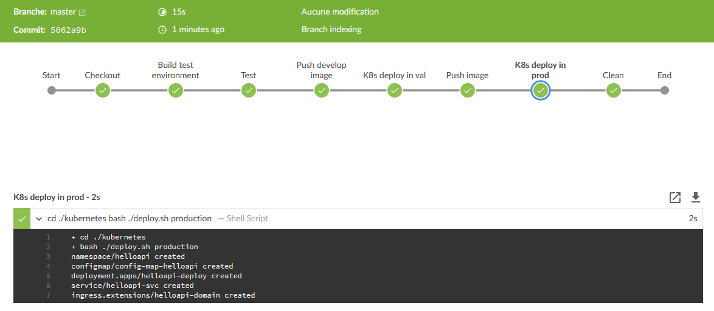

# Installation

### local docker registry
Launch the docker container registry in a docker container
```bash
cd ./registry
sh ./generate-credential.sh
docker-compose up -d
```
It is ready at the url http://localhost:5000

### Jenkins
This command will install jenkins locally
```bash
sh ./jenkins/install.sh
```

### Add the jenkins job helloapi
```bash
cp ./jenkins/jobs/helloapi /var/lib/jenkins/jobs/helloapi
```

### Add docker registry credential in jenkins as global
```
username : developer
password : secret
id       : localRegistryCredential
```

# Usage
the goal being to have a ci / cd from commit to prod, you can trigger a build by :  

- A commit from ./apps/helloapi repository
- A manual trigger on Jenkins ui (http://localhost:5000)


